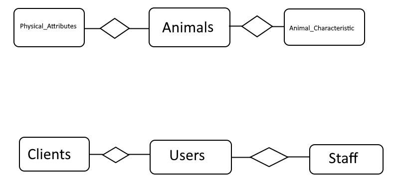

# COMP_3004
Project cuACS

# Current Members
| Name                    | Student numbers          |
|-------------------------|--------------------------|
| Quinn Stevenson         | 100982306                |
| Jones			  | 100977538                |
|                         |                          |
|                         |                          |

# Commits
quinn-stevenson = Lychosand.  There was descrepencies between my two accounts when commiting from the VM

# Building
In order to build this project you must: 
* navigate to where the Makefile is.  It will be inside the QT directory
* ex: `cd /home/student/Desktop/COMP_3004/QT`
* next run: `make` 
* if for whatever reason the Makefile is not there `qmake -o Makefile 3004.pro` will give the makefile

# Running
In order to run this project you must:
* run the command `./3004`
* from here you have to login, there is only one account currently for staff `username: Staff_01` `password: Staff`
* try viewing all the animals/add animals they will populate the table with data

# Database
If you need to check the persistent storage for the cuACS system then here is a very rough edition of the ER diagram for the database:

Some commands to test for data integrity:

* move to directory `SQL_Database`
* run `sqlite3 3004.db`
* run `SELECT * FROM ANIMALS` to view all animal IDs + names
* run `SELECT * FROM PHYSICAL_ATTRIBUTES` to view all information 
* run `.read query.sql` to view the above two tables combined
* run `SELECT * FROM STAFF` to view the current staff accounts

